## Szechuan water-cooked beef

### Material List

(* means optional)

Beef tender loin slices (other slices are also good) ~ 250g

Some vegetables (I used bean sprouts and king mushroom here, some other common stuff would be celtuce, enoki mushrooms, potato, bamboo shoots, taro,  etc. ) ~ 200g

Ginger

Garlic

szechuan pepper (red and green*)

pickled chilis (~ 8)

green onions (small and large*)

Szechuan bean paste (~ 1 tablespoon)

Szechuan pepper powder*

dried chili [I used 2 kinds, but you could just use one]

minced/ground chili

water or chicken/pork stock

——————Other common stuff——————

Soy sauce

Sugar

White pepper powder

Salt

### Steps

1. Prepare materials as below. Remember to remove the seed from dried chili. Also, minced some garlic (not shown in pic). 

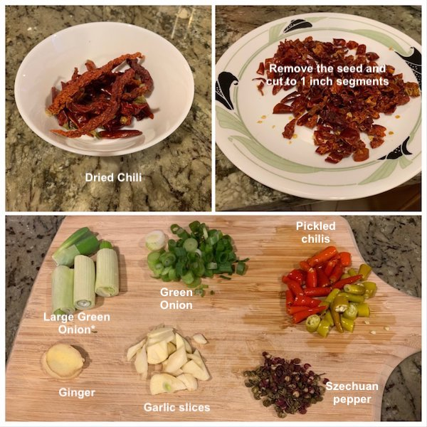

2. Boil some water and cook the vegetables till ready.

   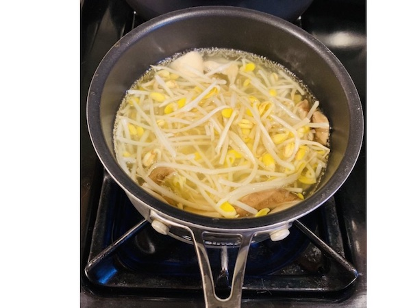

3. Drain the water and find a bowl or a small pot to put the vegetables in.

4. If your beef slice is really thin, no need to marinate. Just cook it like shabu shabu (don't overcook). If it's somewhat a little thick, you can marinate for about 15 min with oil, an egg, 2 tsp of soysauce, some sugar, salt,  2 tbsp of corn starch and some white pepper. Again, cook it like shabu shabu and put it on top of the vegetables. 

   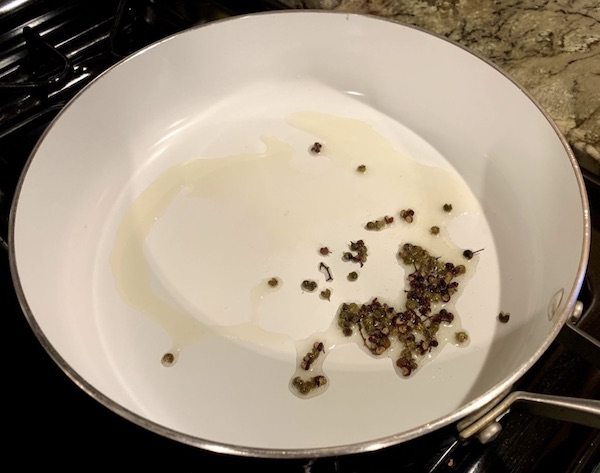

5. Heat your wok, put some oil. I usually wait till the point that I put my hand about 2 fist away I can feel the heat but not burning. Then, add szechuan pepper, and switch to medium heat. Fry till you can smell the scent from those peppers. 

   Here, I throw them out, but you could leave them there. 

4. Then, put in garlic slices, ginger and the white part of the green onion. Fry till you can the garlic turning gold but not brown.

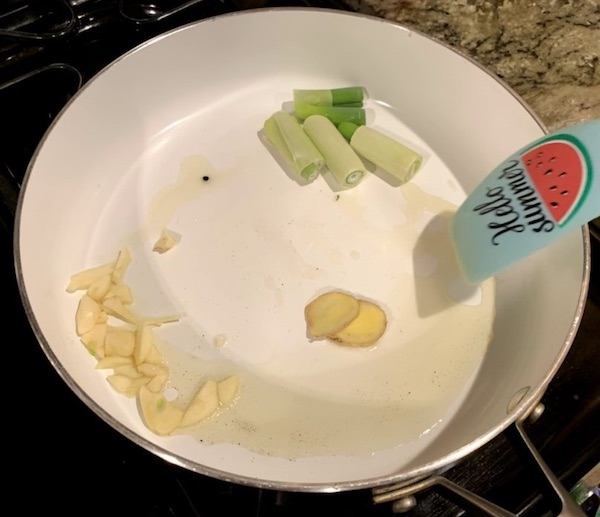

5. Turn to LOW heat and add szechuan bean paste (a tblspoon). 

   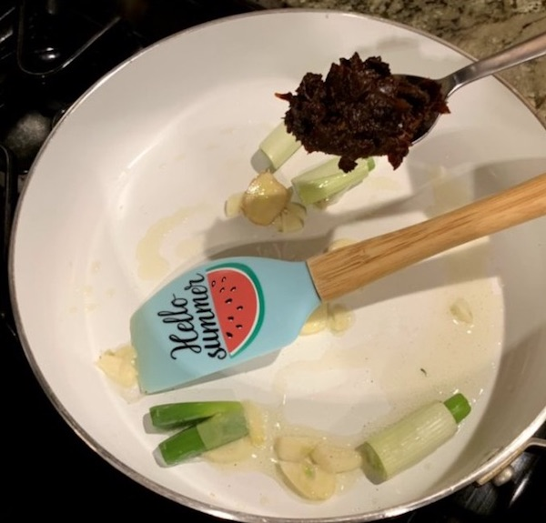

   Also, you could also put in the pickled chilis and ground/minced chili*

   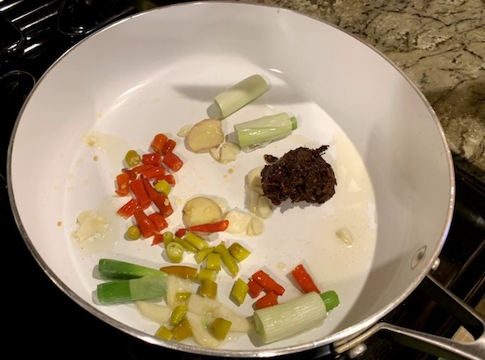

6. (Sry my roommate forgot to take a pic here). Keep LOW heat and stir fry the bean paste till you see the oil becoming bright red. 

7. Then, add water (or broth),  turn on High heat and stir. Add a tblspoon of soysauce. 

   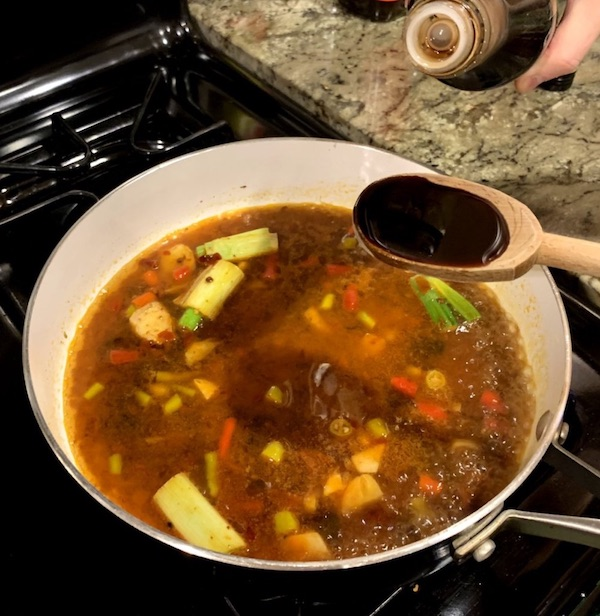

Add some salt, sugar, szechuan pepper powder, ground chili powder, white pepper powder. [Note: no fixed amount, add a little and try]

8. Then, pour the soup into the bowl/pot with beef and vegetables. 

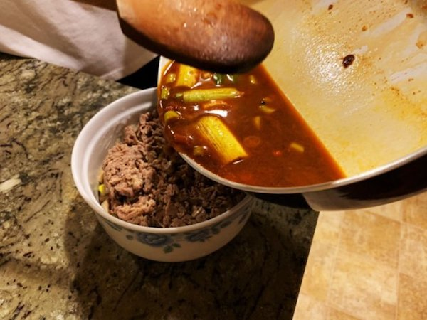

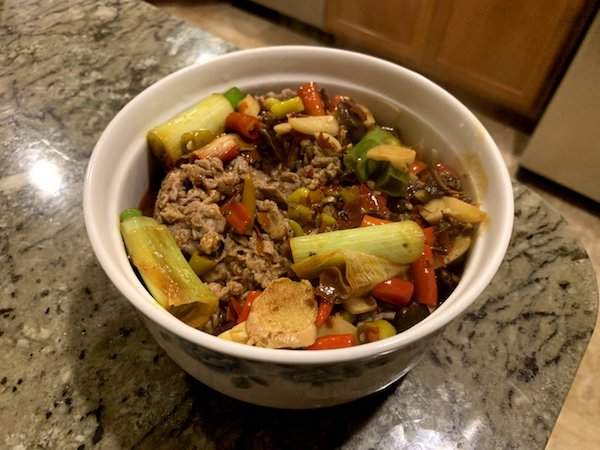

9. Scatter some cut dried chili, ground/minced chili, green onion, minced garlic, szechuan pepper powder and sesame. 

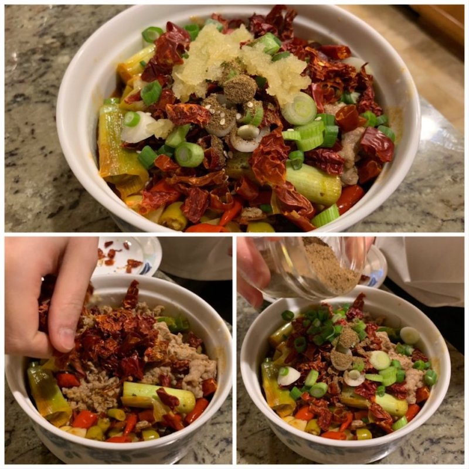

10. Clean your wok. (High Heat)Heat about 2-3 tbs of oil till you can see smoke comes out. Pour it on the chili, garlic and green onions you just put in to revitalize the ingredients. 

    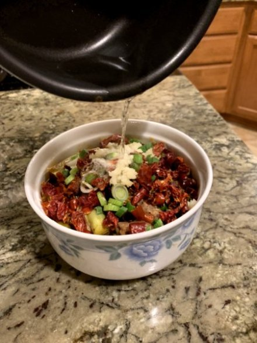